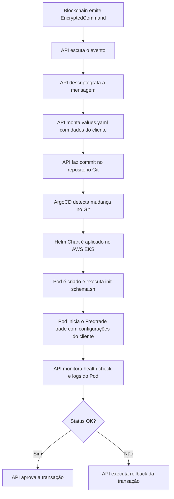

# Command

O objetivo desse documento é mostrar que o Freqtrade apenas iniciará uma Execução caso aconteça uma transação no Smart Contract.

A API saberá que o Freqtrade:
- iniciou uma Execução 
- o Pod estiver Healthy
- respondendo na porta 8080.
- Confirm execution (valida se o que era para estar executando no Pod realmente está executando [trade ou backtest])

## Fluxo de Execução do Comando

1. **API escuta os eventos da Blockchain**  
   - Um evento (por exemplo, `EncryptedCommand`) é emitido na blockchain.  
   - A API da sua plataforma (backend) está constantemente monitorando esses eventos.

2. **API descriptografa a mensagem**  
   - Ao capturar o evento, a API descriptografa o comando para extrair os parâmetros necessários, tais como:  
     - API keys (BINANCE_API_KEY, BINANCE_SECRET_KEY)  
     - Estratégia a ser utilizada  
     - Dados específicos do cliente (ID, etc.)  
     - Nome do schema desejado

3. **API monta os valores para o Pod com base em um template**  
   - Com os dados extraídos, a API preenche um template de configuração (um arquivo `values.yaml` específico) que contém todas as variáveis necessárias para o bot.  
   - Por exemplo, define a variável `DATABASE_URL` com `?search_path=<nome_schema>` e as demais variáveis de ambiente.

4. **API faz um commit no repositório Git (GitOps)**  
   - O template preenchido é commitado em um repositório Git (pasta ou branch específica para o cliente).  
   - Esse commit serve como a “fonte da verdade” para o ArgoCD, que monitora o repositório.

5. **ArgoCD detecta a alteração e cria um novo Pod**  
   - O ArgoCD, ao detectar o commit, executa o Helm chart correspondente (com os valores específicos do cliente) e implanta um novo Deployment no AWS EKS.  
   - Durante a inicialização, o Pod executa o script `init-schema.sh`, que verifica e, se necessário, cria o schema do cliente no banco PostgreSQL RDS (usando o multi-schema).

6. **API monitora o status do novo bot**  
   - A API verifica se o novo Pod foi criado com sucesso, monitorando os health checks (por exemplo, o endpoint `/api/v1/ping`) e analisando os logs.  
   - Essa verificação garante que o comando foi aplicado corretamente e que o bot está funcionando conforme esperado.

7. **API executa um approve ou rollback da transação**  
   - Com base no status do bot (sucesso ou falha na inicialização/health check), a API aprova a transação e comunica o sucesso na blockchain ou, se houver algum erro, executa um rollback (por exemplo, cancelando o deploy ou emitindo um evento de erro para a blockchain).

---

## Diagrama Resumido (Mermaid)

---

## Resumo do Processo

- **Início:** A API recebe e descriptografa um comando criptografado vindo da blockchain.
- **Configuração:** A API utiliza os dados do comando para montar um arquivo de configuração (`values.yaml`) específico para o novo bot.
- **Deploy GitOps:** Esse arquivo é commitado no repositório Git, acionando o ArgoCD para aplicar as configurações via Helm Chart no cluster AWS EKS.
- **Provisionamento do Bot:** Durante o boot, o Pod executa o script `init-schema.sh` que cria o schema no Postgres RDS (caso não exista) e, em seguida, inicia o Freqtrade em modo trade.
- **Monitoramento:** A API monitora o status do Pod para confirmar o sucesso do deploy.
- **Decisão Final:** Com base no monitoramento, a API aprova a transação na blockchain ou executa um rollback.

---

Esse fluxo garante que cada novo comando gera a implantação isolada de um bot com configurações exclusivas, utilizando GitOps para gerenciamento e Kubernetes para escalabilidade e isolamento. Se precisar de mais detalhes ou ajustes, estou à disposição!