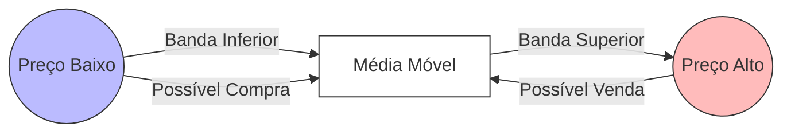
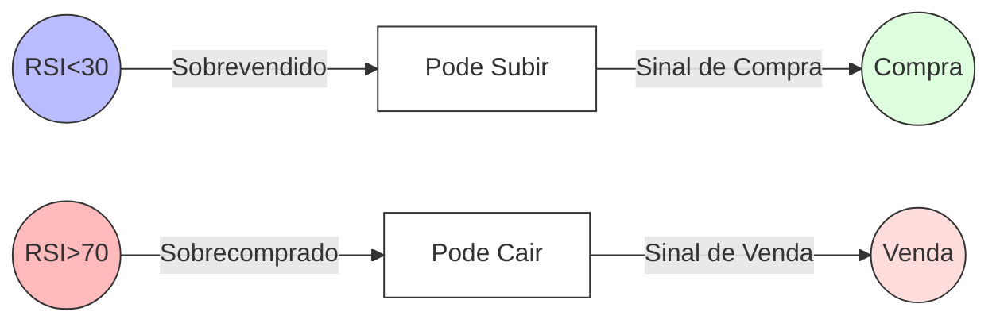
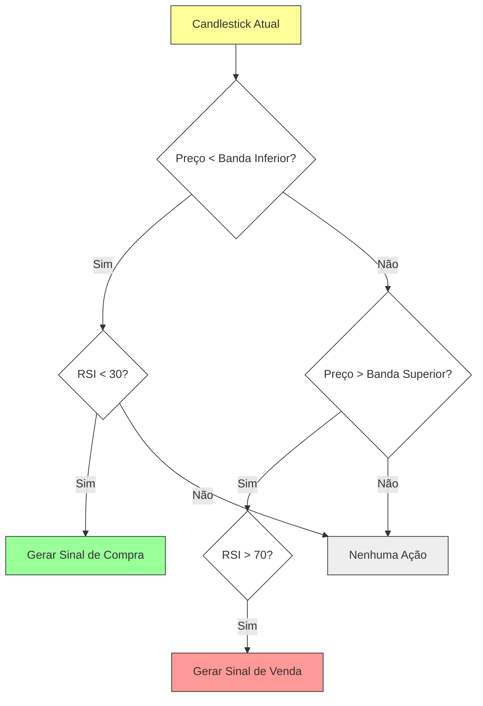

## 1. Introdução

No mercado de criptomoedas (e em outros mercados financeiros), a automação de estratégias é uma forma cada vez mais popular de operar. Uma ferramenta amplamente utilizada para esse fim é o **Freqtrade**, que permite criar, testar e executar estratégias de investimento de forma automatizada.

Para ter sucesso nesse tipo de operação, não basta apenas ter um robô executando ordens. É fundamental contar com **estratégias bem definidas**, que estejam alinhadas com o comportamento do mercado e com o perfil de risco do investidor. Neste artigo, vamos apresentar uma estratégia chamada **CombinedBinHAndCluc**, que combina dois indicadores clássicos do mercado: **Bollinger Bands** e **RSI (Índice de Força Relativa)**.

O objetivo aqui é **explicar, de forma didática e acessível**, como esses indicadores funcionam e como a estratégia os utiliza para gerar sinais de compra e venda.

---

## 2. Explicação dos Indicadores Utilizados

### 2.1 Bollinger Bands (Bandas de Bollinger)

As **Bollinger Bands** são formadas por três linhas:

1. **Banda Superior** (Upper Band)  
2. **Média Móvel** (Middle Band)  
3. **Banda Inferior** (Lower Band)

A ideia principal é que a **média móvel** representa um valor médio de preço em um determinado período, enquanto as bandas superior e inferior são calculadas adicionando e subtraindo um desvio padrão desse preço médio.

- **Banda Superior**: Média Móvel + (Desvio Padrão * Fator)  
- **Banda Inferior**: Média Móvel – (Desvio Padrão * Fator)

Quando o preço se aproxima da banda inferior, costuma indicar que o mercado está “barato” em relação à sua média recente, podendo ser um sinal de **compra**. Quando o preço está próximo da banda superior, normalmente está “caro”, podendo ser um sinal de **venda** ou de precaução para quem está comprado.

Para ilustrar, pense em um elástico que se estica e se retrai em torno de um valor médio:  
- Quando o elástico está muito esticado (preço perto da banda superior), há mais chance de retornar ao normal.  
- Quando ele está “folgado” (preço perto da banda inferior), o mercado pode estar subvalorizado e tende a voltar para a média.

#### Exemplo ilustrativo em Mermaid

No diagrama acima, mostramos de forma simplificada a ideia de que o preço oscila entre a **Banda Inferior** e a **Banda Superior**, tendo a **Média Móvel** como referência.

---

### 2.2 RSI (Índice de Força Relativa)

O **RSI (Relative Strength Index)** é um indicador que mede a velocidade e a variação dos movimentos de preço. Ele varia de **0** a **100** e costuma indicar:

- **Sobrecompra (Overbought)**: Quando o RSI está acima de 70 (ou 80, dependendo da configuração). Isso significa que o preço subiu muito rapidamente e pode haver uma correção (queda).  
- **Survendido (Oversold)**: Quando o RSI está abaixo de 30 (ou 20), indicando que o preço caiu muito rapidamente, podendo ocorrer uma recuperação (subida).

Imagine que o RSI é como um “termômetro de entusiasmo” do mercado:  
- Se o termômetro estiver muito alto (acima de 70), significa que o mercado pode estar eufórico demais.  
- Se estiver muito baixo (abaixo de 30), pode indicar um pessimismo exagerado.

#### Exemplo ilustrativo em Mermaid

No diagrama, mostramos as duas regiões extremas do RSI (abaixo de 30 e acima de 70) e seus significados.

---

## 3. Como a Estratégia CombinedBinHAndCluc Funciona?

A estratégia **CombinedBinHAndCluc** une esses dois indicadores para criar sinais de entrada e saída de forma complementar.

1. **Bollinger Bands** ajuda a identificar se o preço está em um ponto interessante em relação à média (região “barata” ou “cara”).  
2. **RSI** ajuda a verificar se o mercado está sobrevendido ou sobrecomprado.

A lógica geral pode ser descrita assim:
- **Sinal de Compra**:  
  - Quando o preço toca ou fica abaixo da Banda Inferior das Bollinger Bands, e  
  - O RSI mostra que o ativo está sobrevendido (por exemplo, RSI < 30).  
- **Sinal de Venda**:  
  - Quando o preço toca ou ultrapassa a Banda Superior das Bollinger Bands, e  
  - O RSI mostra que o ativo está sobrecomprado (por exemplo, RSI > 70).

### Fluxo de Decisão Simplificado

Este **fluxo de decisão** ilustra de forma **simplificada** como a estratégia analisa o mercado para gerar sinais de compra e venda.

> **Observação**: No código real da estratégia, podem existir outras regras adicionais (como stop loss, take profit, e configurações específicas do Freqtrade) para refinar os pontos de entrada e saída.

---

## 4. Vantagens e Desvantagens

### 4.1 Vantagens

- **Clareza de Sinais**: A junção de Bollinger Bands e RSI torna os sinais de entrada e saída mais claros.  
- **Filtros Complementares**: Enquanto Bollinger Bands mostra a posição do preço em relação à média, o RSI revela se o mercado está sobrecomprado ou sobrevendido, evitando entrar em operações em momentos desfavoráveis.  
- **Fácil de Entender**: Mesmo para iniciantes, a ideia de “comprar barato e vender caro” torna-se mais tangível com esses dois indicadores.

### 4.2 Desvantagens

- **Falsos Sinais em Lateralizações**: Em mercados muito laterais (sem grandes oscilações), a estratégia pode gerar falsos sinais de compra/venda.  
- **Dependência de Parâmetros**: As configurações de período do RSI (14 períodos, por exemplo) e das Bollinger Bands (20 períodos de média e 2 desvios padrão) podem influenciar muito os resultados.  
- **Sem Proteção Automática**: Se não configurar **stop loss** ou mecanismos de gestão de risco, a estratégia pode sofrer drawdowns (perdas) significativos em quedas bruscas de mercado.

---

## 5. Conclusão e Recomendações

A estratégia **CombinedBinHAndCluc** exemplifica como indicadores clássicos do mercado podem ser combinados para gerar sinais de compra e venda de forma mais assertiva. Com a ajuda do **Freqtrade**, é possível:

1. **Configurar** os parâmetros ideais de Bollinger Bands e RSI de acordo com o perfil de risco.  
2. **Testar em modo Paper Trading**, simulando as operações sem arriscar dinheiro real.  
3. **Otimizar** a estratégia com ajustes nos indicadores e uso de recursos avançados, como trailing stop e análise de volume, para reduzir falsos sinais.

Para quem está começando, a principal recomendação é **entender bem cada indicador** (como mostramos neste artigo) e depois realizar **backtests e forward tests (paper trading)** antes de colocar dinheiro real em jogo. Dessa forma, você vai se familiarizar com a estratégia e ter maior confiança nos sinais que ela gerar.

---

### Dicas Finais

- **Analise o Mercado**: Nenhuma estratégia é 100% eficaz o tempo todo. Mantenha-se atento às notícias e ao comportamento geral do mercado.  
- **Diversifique**: Não coloque todos os recursos em um único ativo ou estratégia.  
- **Mantenha um Diário de Trade**: Registre suas operações e observe onde você acertou ou errou. Isso ajuda a evoluir continuamente.

---

#### Links úteis:
- [Freqtrade Documentation (Inglês)](https://www.freqtrade.io/)  
- [Bollinger Bands Explicação (Inglês)](https://www.investopedia.com/terms/b/bollingerbands.asp)  
- [RSI Explicação (Inglês)](https://www.investopedia.com/terms/r/rsi.asp)

Esses links podem ajudar você a se aprofundar ainda mais nos conceitos abordados aqui. Mas lembre-se: **nada substitui a prática e os testes** em um ambiente seguro antes de arriscar seu capital real.
