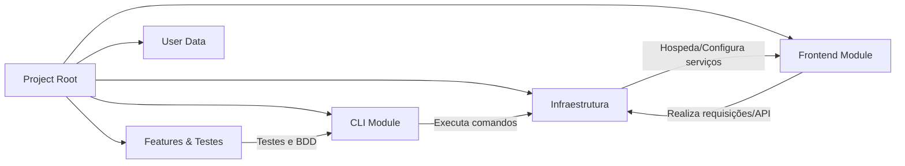
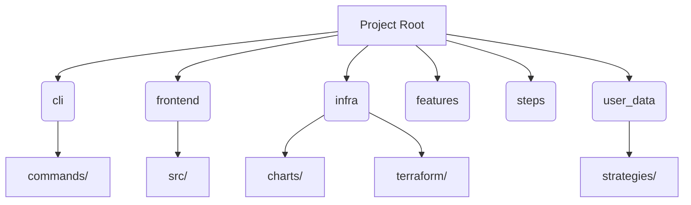

# Bot Freqtrade Strategies

Este projeto contém um conjunto de estratégias e ferramentas para o bot Freqtrade, permitindo realizar negociações automatizadas, realizar backtesting, e gerenciar estratégias através de uma interface web integrada.

## Descrição

O Bot Freqtrade Strategies reúne diversos módulos para:
- Gerenciamento de estratégias de negociação.
- Execução de backtesting para simular performances.
- Publicação e monitoramento das estratégias.
- Integração com ferramentas de infraestrutura como Docker e Terraform para facilitar o deploy.

## Estrutura do Projeto

- **cli/**: Ferramentas de linha de comando para interagir com o bot, incluindo autenticação, execução de backtest e inicialização do bot.
- **frontend/**: Interface web para visualização, gerenciamento e monitoramento das estratégias.
- **infra/**: Scripts e arquivos de configuração para deploy, infraestrutura (Docker, Terraform, Helm) e saúde do sistema.
- **user_data/strategies/**: Contém as estratégias de negociação utilizadas pelo bot.
- Outros arquivos de documentação:  
  - CONFIG.md – Detalhes de configuração do projeto.  
  - BDDExtensionInstallation.md – Instruções para instalação da extensão BDD.  
  - CI_CD_SETUP.md – Configurações de integração e deploy contínuos.  
  - FRONTEND_DEPLOYMENT.md – Orientações para deploy do frontend.

## Diagramas

- [Diagrama de Arquitetura Geral](./docs/diagrama-arquitetura-geral.md)
- [Diagrama de Estrutura de Diretórios](./docs/diagrama-estrutura-diretorios.md)

## Instalação

Siga os passos abaixo para configurar o ambiente:

1. Clone o repositório:
   ```
   git clone <URL-do-repositório>
   ```
2. Instale as dependências:
   - Para o **CLI**, certifique-se de ter Python instalado e instale os requisitos (se houver um requirements.txt correspondente).
   - Para o **Frontend**, navegue até o diretório `frontend` e execute:
     ```
     npm install
     ```
3. Configure as variáveis de ambiente copiando o arquivo `.env.example` para `.env` e ajustando conforme necessário.

## Uso

- **CLI**: Utilize os scripts disponíveis em `cli/cli.py` para interagir com o bot.
- **Frontend**: Para iniciar o servidor de desenvolvimento, navegue até o diretório `frontend` e execute:
  ```
  npm run dev
  ```
- **Infraestrutura**: Consulte o diretório `infra/` para executar scripts de deploy, iniciar containers ou provisionar a infraestrutura com Terraform.
- **Testes**: Os testes podem ser executados consultando o diretório `infra/tests/`.

## Contribuição

Contribuições são bem-vindas! Para colaborar com o projeto, siga estas diretrizes:

1. Faça um fork do repositório.
2. Crie uma branch para sua feature:
   ```
   git checkout -b minha-feature
   ```
3. Faça os commits com mensagens claras.
4. Abra um Pull Request para revisão.

## Licença

Este projeto é licenciado sob a licença MIT. Consulte o arquivo LICENSE para mais informações.

## Contato

Para dúvidas ou mais informações, entre em contato com os mantenedores do projeto.

## Diagramas Mermaid

### Diagrama de Arquitetura Geral

### Diagrama de Estrutura de Diretórios

---
Este README é a porta de entrada para o projeto. Para mais detalhes, consulte os demais arquivos de documentação disponíveis nos diretórios relevantes.