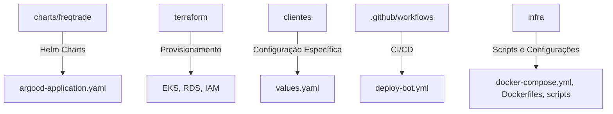

# Infraestrutura do Projeto bot_freqtrade_strategies

Este documento fornece uma visão abrangente sobre a infraestrutura utilizada no projeto, detalhando os componentes, a arquitetura, os fluxos operacionais e as boas práticas para deploy e manutenção dos bots de trading.

## 1. Introdução

O projeto bot_freqtrade_strategies é uma solução robusta para a operação e gerenciamento de bots de trading. A infraestrutura deste projeto é montada sobre tecnologias modernas que garantem escalabilidade, robustez e facilidade de manutenção, utilizando ferramentas como Terraform, Kubernetes (AWS EKS), Helm, ArgoCD e pipelines CI/CD com GitHub Actions.

## 2. Componentes Principais

### 2.1 Provisionamento e Gerenciamento de Infraestrutura
- **Terraform:** Responsável por definir e provisionar os recursos na AWS, incluindo clusters EKS, instâncias RDS, configurações de IAM e VPC.
- **AWS EKS:** Hospeda os containers que executam os bots Freqtrade, possibilitando gerenciamento centralizado e escalabilidade.

### 2.2 Deploy e Orquestração
- **ArgoCD:** Automatiza o deploy e garante a sincronização contínua entre o repositório e o ambiente Kubernetes.
- **Helm:** Simplifica a instalação e a gestão das aplicações Kubernetes mediante os Helm Charts.

### 2.3 Integração Contínua
- **GitHub Actions:** Automatiza testes, deploys e integrações, assegurando que todas as alterações sejam testadas e aplicadas de forma consistente.

## 3. Arquitetura da Infraestrutura

A arquitetura do projeto é ilustrada pelo diagrama abaixo:

```mermaid
flowchart LR
    A[Terraform] --> B[AWS EKS]
    B --> C[Pods Freqtrade]
    C --> D[RDS (PostgreSQL)]
    B --> E[ArgoCD & Helm]
    F[GitHub Actions] --> E
```

## 4. Organização do Repositório

A estrutura da infraestrutura no repositório está organizada da seguinte forma:



## 5. Fluxos Operacionais

### 5.1 Deploy e Sincronização
- **Deploy de Bots:** Atualize o arquivo <code>values.yaml</code> em <code>clientes/</code> para configurar novos bots.
- **Sincronização:** As mudanças são automaticamente sincronizadas via ArgoCD, que atualiza o ambiente Kubernetes conforme necessário.

### 5.2 Inicialização e Atualização
- **Scripts de Inicialização:** Utilizados para a criação de schemas no RDS e outras configurações essenciais.
- **CI/CD:** O pipeline do GitHub Actions automatiza a integração e o deploy contínuo, garantindo alta disponibilidade e atualizações sem interrupções.

## 6. Pré-Requisitos e Configurações

- **Credenciais AWS:** Verifique e atualize as credenciais necessárias para acesso aos serviços AWS (IAM, RDS, EKS).
- **Ferramentas Necessárias:** Certifique-se de ter o Terraform, Helm e ArgoCD instalados e configurados corretamente.
- **Ambiente Local:** Garanta que o ambiente de desenvolvimento esteja alinhado com as configurações do repositório e com as práticas recomendadas.

## 7. Guia de Uso e Manutenção

- **Provisionamento:** Utilize os scripts e arquivos em <code>terraform/</code> para criar ou atualizar a infraestrutura.
- **Deploy:** Modifique os arquivos de configuração (ex: <code>values.yaml</code>) e monitore o deploy via ArgoCD.
- **Manutenção:** Revise e atualize os scripts de inicialização e deploy conforme necessário para manter a infraestrutura otimizada e segura.

## 8. Notas e Recomendações

- Mantenha a documentação e os scripts atualizados conforme evoluções e mudanças na arquitetura.
- Consulte a documentação complementar no arquivo <code>INFRA_ARQ.md</code> para obter detalhes avançados sobre o provisionamento e configurações específicas.
- Realize revisões periódicas dos processos de deploy para garantir a eficácia e a segurança do ambiente.

## 9. Contatos e Suporte

Em caso de dúvidas ou para suporte adicional, entre em contato com a equipe responsável pela infraestrutura do projeto.