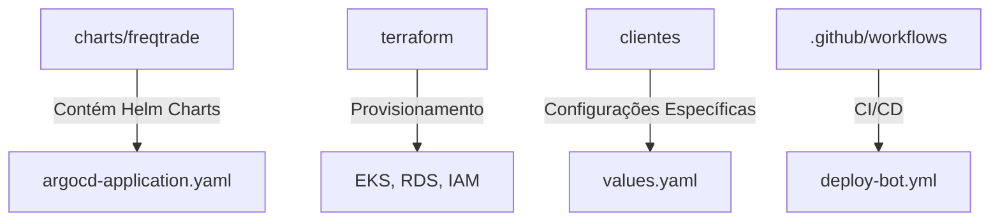

# Infraestrutura - README

Este documento fornece uma visão geral da infraestrutura do projeto bot_freqtrade_strategies. Ele abrange as tecnologias utilizadas, a organização dos arquivos e os fluxos operacionais para deploy e gerenciamento dos bots.

## 1. Visão Geral

A infraestrutura é composta por:
- Provisionamento com Terraform (EKS, RDS, IAM, etc.)
- Deploy via ArgoCD e Helm
- Configuração Multi-Tenant dos bots Freqtrade
- Pipeline CI/CD com GitHub Actions

## 2. Arquitetura da Infraestrutura

```mermaid
flowchart LR
    A[Terraform] --> B[AWS EKS]
    B --> C[Pods Freqtrade]
    C --> D[RDS (PostgreSQL)]
    B --> E[ArgoCD & Helm]
    F[GitHub Actions] --> E
```

## 3. Organização do Repositório



## 4. Fluxos Operacionais

Os fluxos principais incluem:
- Deploy de novos bots via commit de configuração (values.yaml);
- Sincronização automática via ArgoCD;
- Execução de scripts de inicialização para criação de schemas no RDS.

## 5. Notas

- Certifique-se de ter as credenciais corretas para acesso à AWS e ao RDS.
- A documentação é atualizada periodicamente conforme novas atualizações na infraestrutura.