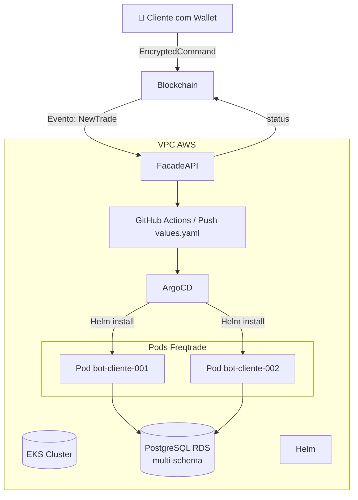

Perfeito! Com base no seu stack e nos fluxos que discutimos, aqui está uma **arquitetura de infraestrutura detalhada** para sua plataforma `bot_freqtrade_strategies`, incluindo os componentes AWS, Kubernetes, Helm, GitOps com ArgoCD, Freqtrade services e a sua **Facade API** que interage com a blockchain e gerencia os bots.

---

Requisito:

LocalStack Pro : 

LocalStack Pro é a versão comercial do LocalStack que oferece suporte para serviços adicionais da AWS – como RDS e EKS – que não estão implementados na versão gratuita. Isso significa que, para criar recursos como RDS e EKS no ambiente local, é necessário rodar a versão Pro do LocalStack e configurar as chaves de acesso adequadas (por exemplo, definindo a variável de ambiente LOCALSTACK_API_KEY).

---

Env variables:

LOCALSTACK_API_KEY


---

# 🏗️ Arquitetura de Infraestrutura – `bot_freqtrade_strategies`

---

## 🔧 Tecnologias Principais

| Camada        | Tecnologia            | Descrição                                                                                                                                      |
|---------------|------------------------|------------------------------------------------------------------------------------------------------------------------------------------------|
| Orquestração  | **AWS EKS**            | Cluster Kubernetes gerenciado onde rodam os Pods de bots e serviços                                                                           |
| Banco de dados| **AWS RDS (PostgreSQL)** | Banco compartilhado com múltiplos **schemas isolados por cliente**                                                                             |
| Deploy GitOps | **Helm + ArgoCD**      | Helm para templates parametrizáveis de bots, ArgoCD para aplicar automaticamente configurações do Git                                          |
| Deploy CI/CD  | **GitHub Actions**     | Automação de build das imagens Docker e commit dos values/configs específicos no repositório monitorado pelo ArgoCD                           |
| Execução bots | **Freqtrade Docker**   | Imagem Docker customizada com `init-schema.sh`, configurável via ENV                                                                          |
| Backend API   | **Facade API (Node/Python)** | Recebe comandos criptografados, gerencia lógica de deploy dos bots, interage com a blockchain, PostgreSQL e Git                                |

---

## 📐 Diagrama de Arquitetura (resumo)



---

## ⚙️ Componentes Detalhados

### 🔹 1. **EKS Cluster**
- Hospeda todos os **Pods de bots** (`freqtrade trade`) e serviços internos (Facade API, ArgoCD, etc.)
- Criado e gerenciado via **Terraform** (`eks.tf`)
- Possui namespaces:
  - `freqtrade` (bots)
  - `infra` (ArgoCD, ingress, secrets)

### 🔹 2. **RDS PostgreSQL**
- Um banco de dados Postgres único, com **um schema por cliente**
- Usuários distintos com permissão restrita ao seu schema
- Cada Pod recebe `DATABASE_URL` com `search_path=cliente_xyz`

### 🔹 3. **Freqtrade Service (Docker Image)**
- Baseada em `freqtradeorg/freqtrade:stable`
- Customizada com:
  - `init-schema.sh` que cria schema ao subir o Pod
  - Estratégias padrão + suporte a estratégias personalizadas via volume/ENV
- Expõe API na porta 8080 (`/api/v1/ping`, `/status`, etc.)

### 🔹 4. **Facade API**
- Serviço HTTP rodando no EKS (ou ECS se quiser desacoplar)
- Responsável por:
  - Escutar eventos da blockchain (`EncryptedCommand`)
  - Descriptografar e montar config do cliente
  - Criar `values.yaml` e fazer commit no Git
  - Monitorar health dos bots
  - Confirmar sucesso/falha via **approve/rollback** on-chain

### 🔹 5. **ArgoCD + Helm**
- ArgoCD observa repositório Git (com pasta `clientes/cliente-001/values.yaml`)
- Helm template parametriza a criação do bot (envs, estratégia, banco)
- ArgoCD faz deploy automático no cluster

### 🔹 6. **GitHub Actions**
- Executa:
  - Build da imagem Freqtrade (`Dockerfile.freqtrade`)
  - Push para o registry
  - Commit de `values.yaml` em `/clientes/cliente-001`
- ArgoCD detecta e aplica

---

## 🔁 Fluxo completo de **Nova Trade**

1. **Cliente envia transação on-chain** com comando `EncryptedCommand`
2. **Facade API detecta o evento** e descriptografa a mensagem
3. API monta:
   - `FREQTRADE_STRATEGY`
   - `BINANCE_API_KEY`, `BINANCE_SECRET_KEY`
   - `DATABASE_URL` com `search_path=cliente_123`
4. API **cria ou atualiza** `values.yaml` do cliente (ex: `/clientes/cliente-123/values.yaml`)
5. API **faz commit no Git**
6. ArgoCD detecta e aplica via Helm:
   - Cria um novo Pod com o bot
   - Executa `init-schema.sh` para criar o schema (se não existir)
   - Inicia `freqtrade trade` no Pod
7. API monitora `/api/v1/ping` + logs
8. Se estiver OK → emite **approve()**
9. Se falhar → emite **rollback()**

---

## 📁 Organização do Repositório Git

```bash
/
├── infra/
│   ├── charts/
│   │   └── freqtrade/
│   │       ├── templates/
│   │       ├── values.yaml       # valores padrão
│   │       └── Chart.yaml
│   ├── scripts/
│   │   └── init-schema.sh
│   └── argocd-application.yaml
├── clientes/
│   ├── cliente-001/
│   │   └── values.yaml
│   ├── cliente-002/
│   │   └── values.yaml
├── Dockerfile.freqtrade
└── .github/
    └── workflows/
        └── deploy-bot.yml  # CI/CD GitHub Actions
```

---

## ✅ Infraestrutura como Código

### Terraform (`/terraform`)
- `eks.tf`: cluster EKS
- `rds.tf`: instância RDS Postgres
- `iam.tf`: roles e policies para acesso ao RDS
- `vpc.tf`: rede, subnets, NAT gateway, etc.
- `outputs.tf`, `variables.tf`

---

## 🚀 Benefícios da Arquitetura

| Requisito                        | Atendido |
|----------------------------------|----------|
| Isolamento de dados por cliente | ✅        |
| Deploy dinâmico por evento      | ✅        |
| Escalável (100+ bots)           | ✅        |
| Seguro (separação por schema + usuário) | ✅   |
| GitOps / Auditável              | ✅        |
| Sem dependência de plataforma PaaS | ✅     |

---

## Próximos passos

Se quiser, posso agora:

✅ Gerar um exemplo de `values.yaml` para cliente  
✅ Criar um `argocd-application.yaml` por cliente  
✅ Escrever um `deploy-bot.sh` que simula a ação da Facade API  
✅ Esboçar a API de backend (Node/Python) que automatiza tudo

Qual dessas partes você quer que eu gere agora?