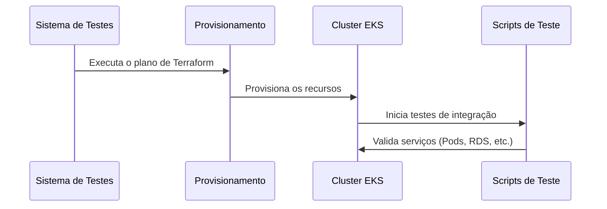
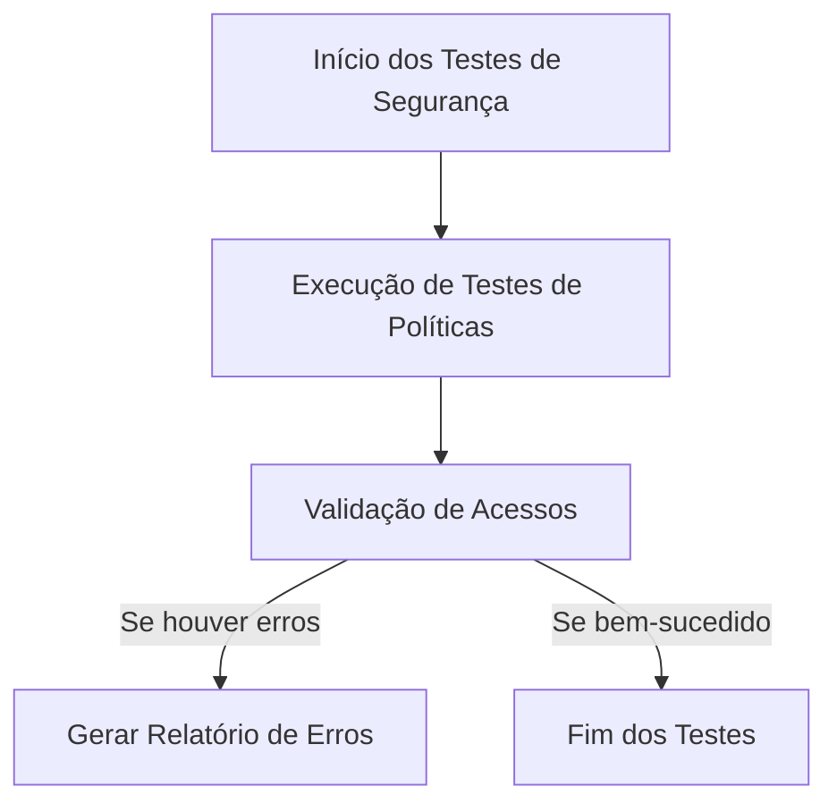

# Testes de Infraestrutura

Este documento descreve os testes automatizados e manuais executados na infraestrutura do projeto bot_freqtrade_strategies. Ele abrange os testes de integração, testes de segurança e a validação das políticas implementadas.

## 1. Visão Geral dos Testes

Os testes garantem que:
- A infraestrutura provisionada com Terraform está funcionando corretamente;
- O cluster EKS recebe os deployments via ArgoCD e Helm;
- As conexões com o RDS e a configuração multi-tenant estão operacionais;
- As políticas de segurança e acesso estão devidamente implementadas e validadas.

## 2. Fluxo de Testes Automatizados

## 3. Testes de Políticas e Segurança

## 4. Relatórios e Monitoramento

Os resultados dos testes são:
- Coletados e armazenados em sistemas de logging centralizados;
- Monitorados em tempo real via ferramentas como Prometheus e Grafana;
- Integrados ao pipeline CI/CD do GitHub Actions para feedback imediato.

## Conclusão

Os testes garantem a confiabilidade e segurança da infraestrutura. Qualquer falha encontrada é reportada e tratada prontamente para assegurar a estabilidade do sistema.