# Testes de Infraestrutura

Este documento descreve as definições e diretrizes para a execução dos testes de infraestrutura do projeto "bot_freqtrade_strategies". Aqui, detalhamos como a infraestrutura funciona e os passos necessários para testar e validar este ambiente.

## Definições de Infraestrutura

1. **Cluster Kubernetes (AWS EKS)**  
   - Ambiente onde são executados os pods contendo os bots e serviços internos.
   - Gerenciado via Terraform, com namespaces distintos para "freqtrade" (bots) e "infra" (ferramentas de gerenciamento).

2. **Banco de Dados (AWS RDS - PostgreSQL)**  
   - Instância única de Postgres com um schema dedicado para cada cliente, garantindo isolamento de dados.
   - Utiliza o parâmetro "search_path" para direcionar conexões ao schema correto.

3. **Deploy GitOps com Helm e ArgoCD**  
   - Configurações de deploy versionadas no Git e aplicadas automaticamente via ArgoCD.
   - Helm permite templates parametrizáveis para implantações dinâmicas.

4. **CI/CD com GitHub Actions**  
   - Pipelines automatizados que constroem imagens Docker, atualizam arquivos de configuração (como <code>values.yaml</code>) e realizam deploy contínuo.
   - Integração com ArgoCD para atualizações imediatas no cluster.

5. **Facade API**  
   - Ponto central para o processamento de comandos criptografados vindos da blockchain.
   - Gerencia a configuração dos bots, monitora a saúde dos serviços (por meio de endpoints como <code>/api/v1/ping</code>) e executa operações de approve/rollback conforme necessário.

## Como Testar e Validar a Infraestrutura

- **Provisionamento com Terraform**  
  - Execute os scripts (ex.: <code>eks.tf</code>, <code>rds.tf</code>, <code>iam.tf</code>, etc.) para provisionar ou atualizar os recursos na AWS.

- **Monitoramento dos Deployments (ArgoCD)**  
  - Verifique a interface do ArgoCD para confirmar a sincronização dos deployments e o estado dos pods.

- **Execução dos Pipelines CI/CD**  
  - Acompanhe os workflows do GitHub Actions para validar a construção das imagens Docker e a atualização dos arquivos de configuração.

- **Testes Automatizados**  
  - Utilize os scripts e testes automatizados contidos neste diretório (como <code>run.sh</code> e demais testes) para simular cenários de deploy e garantir a integridade do ambiente.

## Arquitetura dos Testes Automatizados

A arquitetura dos testes no projeto "bot_freqtrade_strategies" foi concebida para garantir uma verificação completa de todos os componentes da infraestrutura. Os principais pontos desta arquitetura são:

1. **Camada de Provisionamento e Infraestrutura**:  
   - Valida a criação e configuração do cluster Kubernetes através dos scripts Terraform.  
   - Verifica a disponibilidade e integridade dos recursos, como pods e serviços, após o deploy.

2. **Camada de Integração**:  
   - Utiliza arquivos de especificação (.feature) que descrevem cenários de testes baseados na linguagem Gherkin.  
   - As step definitions, localizadas em <code>infra/tests/steps/</code>, traduzem estes cenários em ações que interagem com a infraestrutura, simulando cenários reais de uso.

3. **Camada de Testes de Segurança e Políticas**:  
   - Os testes de políticas de segurança são definidos em arquivos como <code>infra_tests_policy.feature</code> e verificam a conformidade com as melhores práticas de segurança na AWS.  
   - Scripts customizados em <code>infra/tests/security/</code> suportam essas validações.

4. **Camada de Automação e Monitoramento**:  
   - O script <code>run.sh</code> atua como orquestrador, iniciando todos os testes automaticamente e agregando logs e resultados.  
   - A integração com CI/CD (GitHub Actions) permite a execução contínua destes testes como parte do pipeline, garantindo feedback imediato e a manutenção da qualidade do ambiente.

### Detalhamento do Funcionamento dos Testes Automatizados

Cada camada da arquitetura foi desenhada para oferecer isolamento e robustez:
- **Provisionamento**: Os testes verificam a exatidão dos scripts Terraform, utilizando comandos do Kubernetes para assegurar que os serviços estejam ativos e corretamente configurados.
- **Integração**: Os arquivos .feature são executados por frameworks BDD (como Behave ou Cucumber). Os step definitions, localizados em <code>infra/tests/steps/</code>, interagem diretamente com a API da infraestrutura para simular cenários reais.
- **Segurança**: Os testes de políticas não apenas validam as configurações AWS, mas também simulam cenários de acesso indevido, garantindo a robustez das regras de segurança estabelecidas.
- **Automação**: O script <code>run.sh</code> inicia os testes em containers Docker isolados, coleta logs em tempo real e gera relatórios detalhados que são integrados ao pipeline de CI/CD para análise contínua.

## Uso do LocalStack nos Testes

LocalStack é uma ferramenta que simula serviços da AWS no ambiente local, permitindo a execução dos testes sem a necessidade de acessar recursos reais. Em nosso projeto, LocalStack é utilizado para emular serviços como S3, DynamoDB, SQS e Lambda, possibilitando a validação de integrações e comportamentos dos serviços de forma isolada e segura. A configuração do LocalStack é gerenciada via Docker, e os testes automatizados se conectam aos endpoints locais fornecidos pelo LocalStack para garantir a consistência dos cenários de teste.

## Diagramas Adicionais

### Diagrama da Arquitetura de Infraestrutura

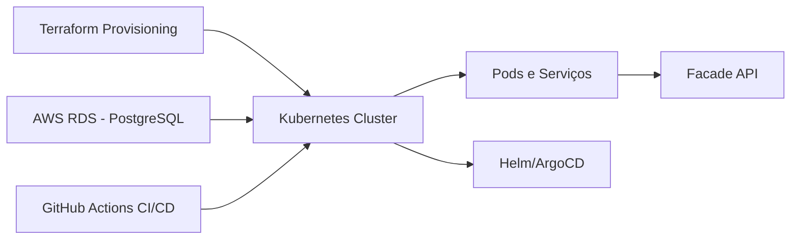

### Diagrama do Fluxo dos Testes Automatizados

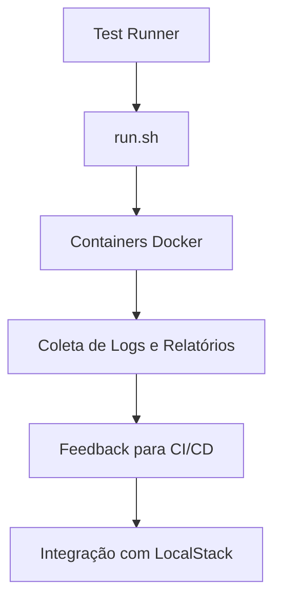

### Diagrama de Interação com LocalStack

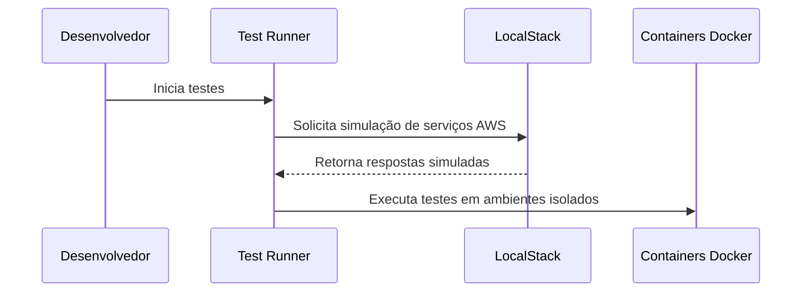

### Diagrama do Pipeline CI/CD com Testes

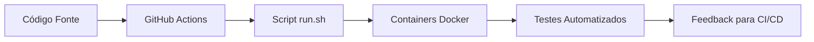

### Diagrama de Execução dos Testes de Segurança

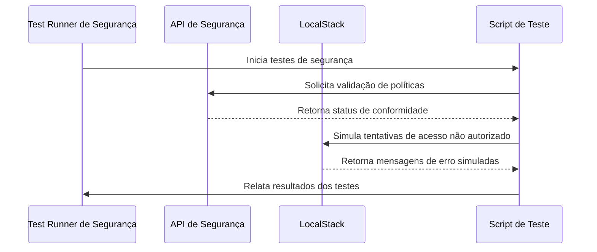

### Diagrama de Provisionamento com Terraform

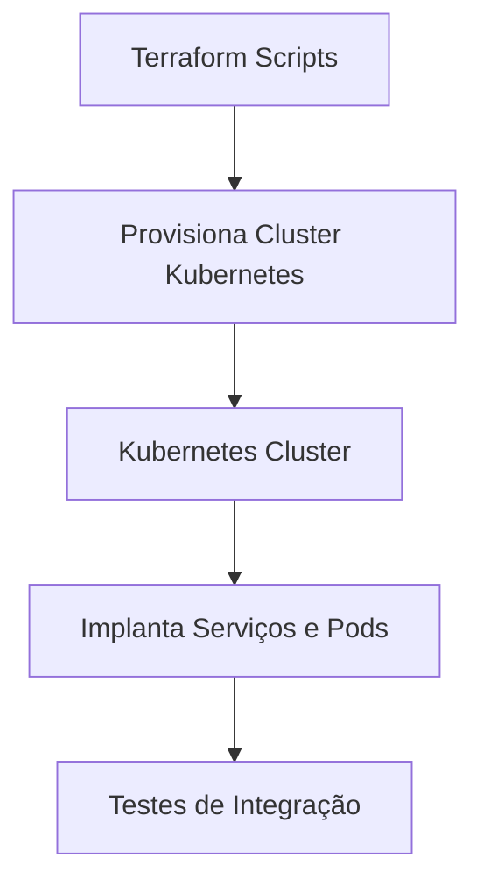

### Diagrama de Comunicação da Facade API

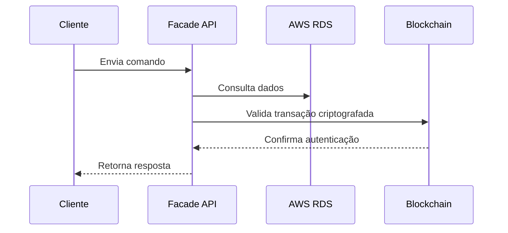

### Diagrama de Monitoramento dos Deployments

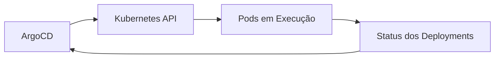

### Diagrama de Agregação de Logs e Relatórios

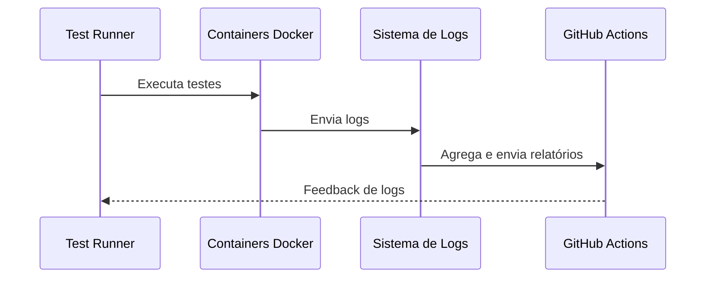

### Diagrama de Escalabilidade e Balanceamento de Carga

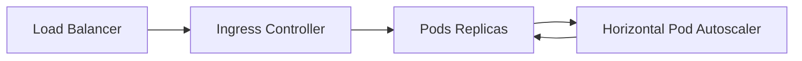

### Diagrama de Atualização de Deployments via GitOps

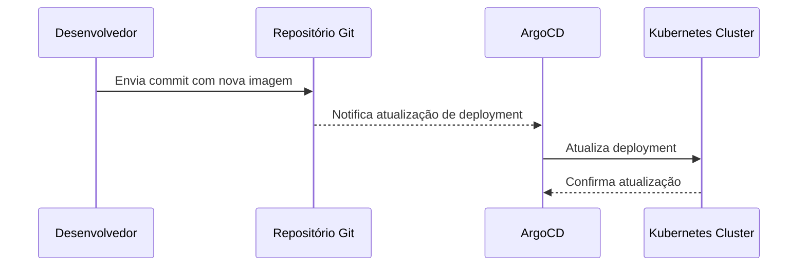

### Diagrama de Testes de Performance

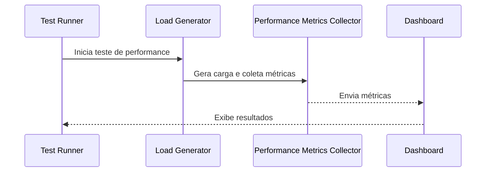

### Diagrama de Falha e Recuperação em Testes

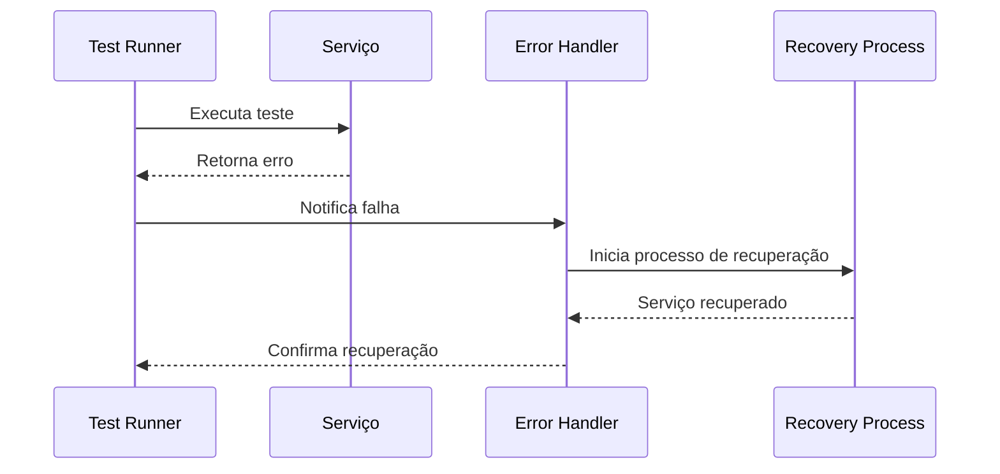

### Diagrama do Ambiente de Teste com Docker Compose

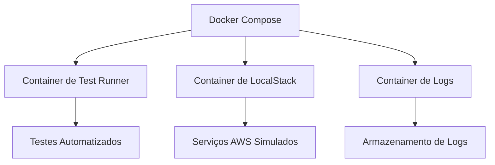

### Diagrama de Execução dos Testes BDD
### Diagrama de Execução dos Testes BDD

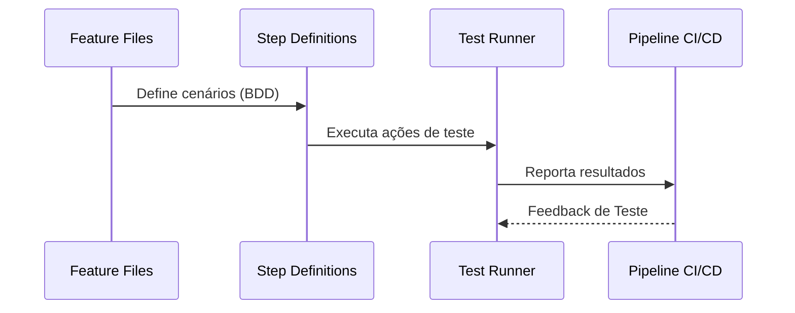

### Diagrama de Rollback de Deployments

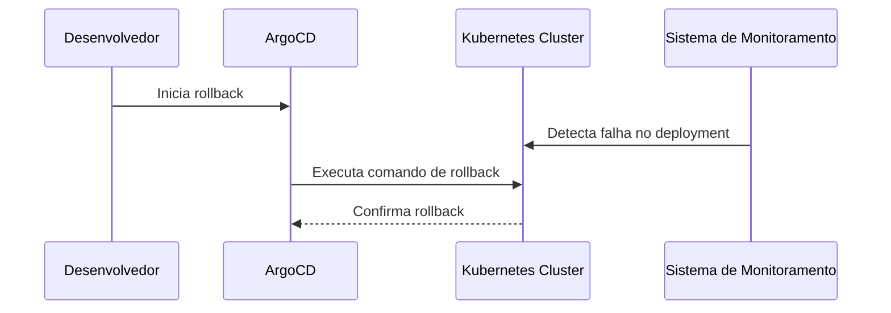

### Diagrama de Auditoria e Logs de Segurança

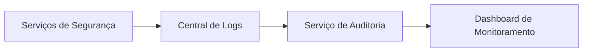

## Conclusão

A integração entre Terraform, Helm, ArgoCD e os pipelines CI/CD proporciona um ambiente escalável, seguro e auditável. Estas definições e procedimentos asseguram que a infraestrutura do projeto seja mantida e evolua de forma eficiente.

## Próximos Passos

- Implementar verificação das IAC Policies com Checkov para garantir a conformidade com as melhores práticas de segurança na AWS e Terraform.
- Desenvolver casos de testes para validar upgrade e downgrade de versões do provider AWS e Terraform, assegurando compatibilidade e reversibilidade dos deployments.
- Integrar esses testes ao pipeline de CI/CD para execução contínua e feedback imediato.